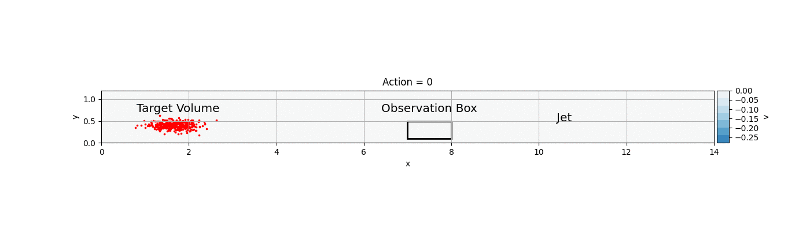

# CS394R Final Project - Reinforcement Learning Control of Large Scale Motions in Turbulent Flows

*This is the code base for the final project of Alex Tsolovikos for CS394R - Reinforcement Learning: Theory and Practice - Spring 2022 at The University of Texas at Austin.*

The goal of this project is to design a reinforcement learning (RL) agent that will target fluid volumes (indicated by tracer particles) in a (mean) turbulent boundary layer and move them closer to the wall. Actuation is done with a downwash-inducing jet that accelerates the flow in a localized region of the boundary layer and is controlled by a single input a_t \in [0,1]. The reward is maximizing the induced downwash that the target volume encounters while minimizing actuation cost.

## Requirements
Install the python packages in `requirements.txt`:

```sh
$ python3 -m venv env
$ source env/bin/activate
$ pip install -r requirements.txt
$ python -m ipykernel install --user --name=env
`````````

## PPO + LSTM Agent with Discrete Actions
The animation below demonstrates the trained policy in action. The target volume is marked by red particles and is detected by an observation box upstream of the actuator. When the control input is 1, the jet slowly ramps up its induced downwash, pushes the target volume toward the wall, and then turns off. The observations are preprocessed by an LSTM network that handles the time delays between observing and actuating on each target volume.

